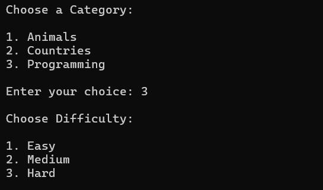
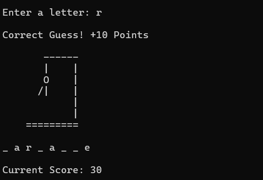
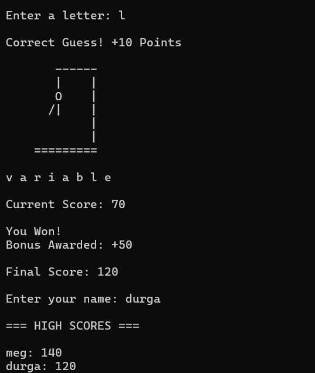
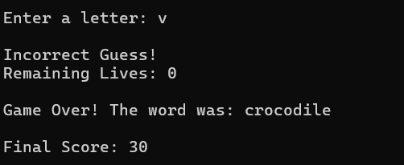
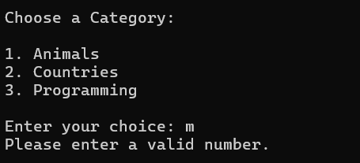

# Hangman Game 🎮

A modular terminal-based Hangman game built using Python featuring category selection, difficulty levels, ASCII visuals, score tracking, JSON-based high score persistence, replay functionality, and object-oriented architecture.

---

# ✨ Features

## 🎯 Gameplay Features

- Category selection system
- Difficulty levels (Easy, Medium, Hard)
- ASCII-based Hangman visuals
- Real-time score tracking
- Replay game functionality
- Duplicate guess detection
- Input validation handling

---

## 🏆 Score System

- Live score updates
- Win bonus points
- JSON-based high score storage
- Persistent leaderboard system

---

## 🧠 Software Engineering Features

- Modular project architecture
- Object-oriented programming using classes
- File handling using JSON
- Clean separation of concerns
- Structured project organization

---

# 🛠️ Tech Stack

- Python
- JSON
- Git
- GitHub

---

# 📸 Screenshots

## Main Menu



---

## Gameplay Screen



---

## Winning Screen



---

## Game Over Screen



---

## Invalid Input Handling



---

## Replay System


---

# ⚙️ Setup Instructions

1. Clone the repository

```bash
git clone https://github.com/Meghana-Merla/hangman_python.git
```

2. Navigate to the project folder

```bash
cd hangman_python
```

3. Run the game

```bash
python main.py
```

---

# 📂 Project Structure

```text
hangman_python/
│
├── main.py
├── game.py
├── words.py
├── utils.py
├── score_manager.py
├── scores.json
├── screenshots/
│   ├── main_menu.png
│   ├── gameplay.png
│   ├── winning.png
│   ├── game_over.png
│   ├── invalid_input.png
│   └── replay_prompt.png
│
├── README.md
└── .gitignore
```

---

# 📌 Future Improvements

- Timer mode
- Hint system
- Multiplayer mode
- Colored terminal output
- Statistics dashboard

---

# 📚 What I Learned

- Object-Oriented Programming (OOP)
- Modular software architecture
- JSON file handling and persistence
- Input validation and edge-case handling
- State management in game development
- CLI application development
- Git and GitHub workflow management
- Designing scalable Python applications

---

# 👩‍💻 Developed By

Meghana Merla
